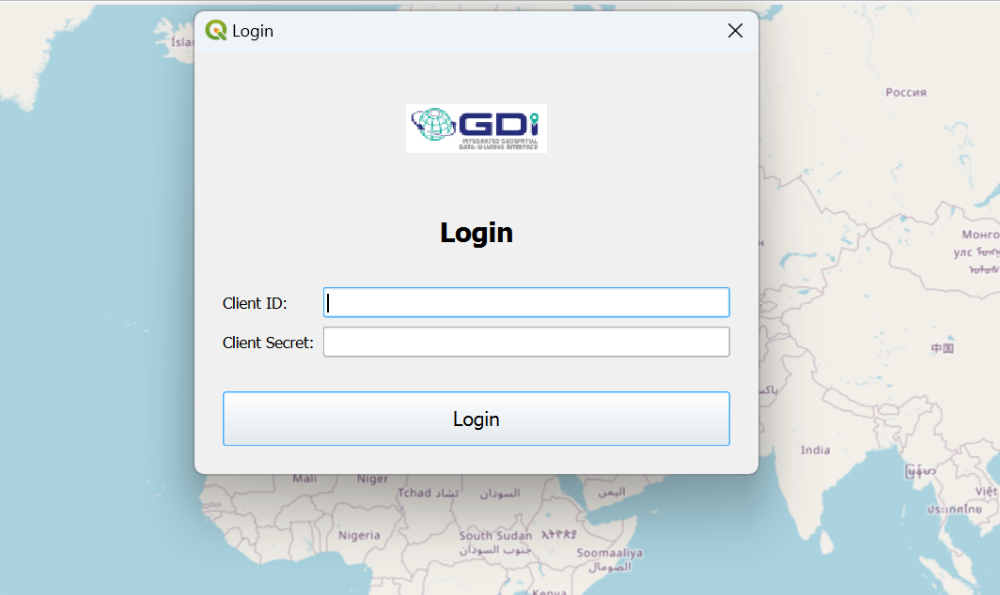
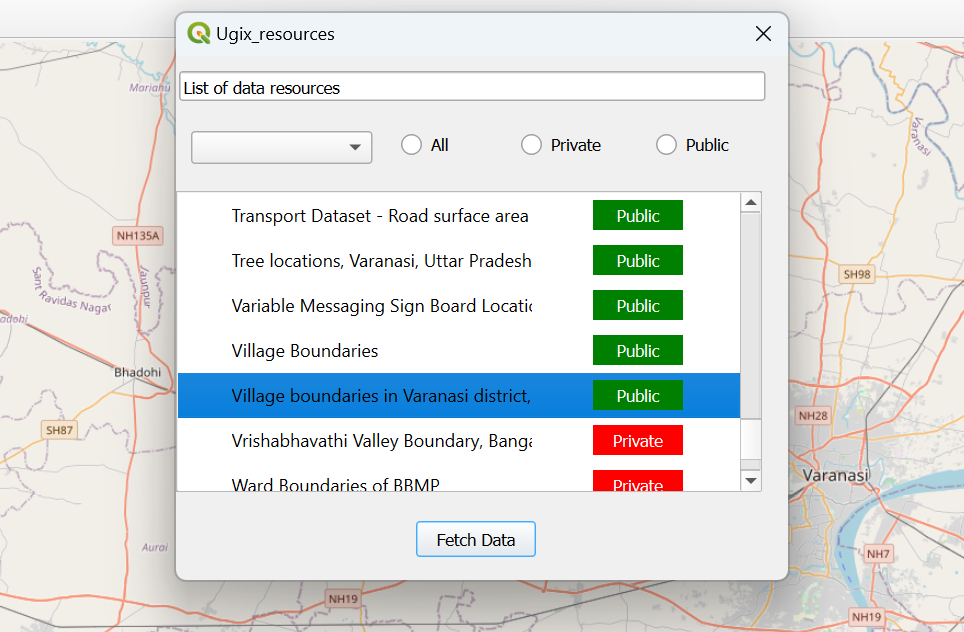
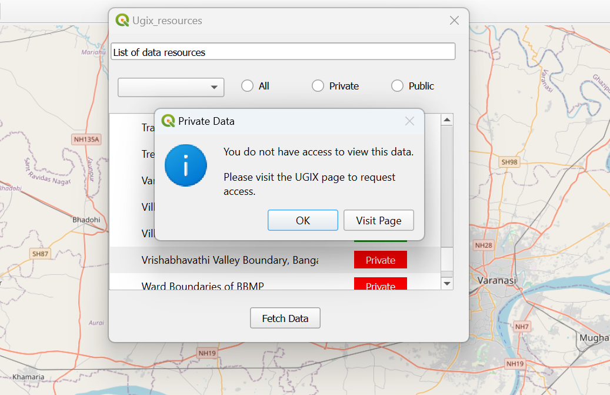
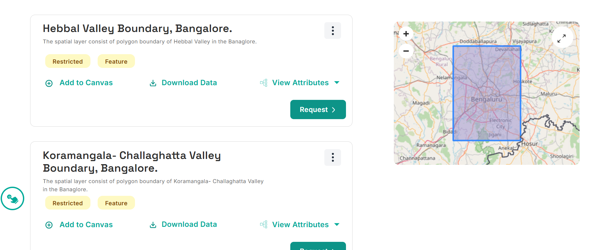

# GDI

The plugin is designed to facilitate seamless discovery and access to data available on the GDI platform by leveraging its integrated APIs: the Data Explorer, Authorization Server, and OGC Resource Server. Through the Data Explorer API, users can efficiently search and locate the datasets relevant to their needs. The Authorization Server API ensures secure and controlled access, verifying user permissions and safeguarding data integrity. Finally, the OGC Resource Server API allows standardized access to geospatial data, enabling direct data retrieval in formats compatible with GIS and other data analysis tools. Together, these components empower users to easily find, access, and utilize the GDI platform's rich data resources for a wide range of applications.

## Registration

A new consumer can register for an account when prompted to log in at either the [Catalogue Panel](https://catalogue.gsx.org.in) or the [Consumer Panel](https://catalogue.gsx.org.in/consumer). Refer to [Registration](../registration.md) for instructions on how to register.

## Fetching Client Credentials

Once a user has registered as a consumer or has been approved as a provider, they can obtain the user's default client credentials.Refer to [Client Creds](../client-credentials.md) for instructions on how to get the client credentials.

## Installing Qgis Plugin

Open the QGIS application, navigate to the "Plugins" section, and click on "Manage and Install Plugins" to search for and install the GDI plugin. Alternatively, you can visit the QGIS website, download the GDI plugin as a ZIP file, and upload it directly into QGIS.

## 1. Login

You would have previously received the client ID and client secret; use those credentials to log in here.

  *Login*

After a successful login, you will receive a list of both public and private data.

## 3. Accessing Public Data

Accessing public data is simple: click on the desired data, then click "Fetch Data," and it will be plotted on the map.

  *Selecting Public Data*

  *Plotting Public Data*

## 3. Accessing Private Data

For private data, click on the desired data in the list and then click "Fetch Data." A popup will appear.

  *Private Data Popup*

Click on "Visit Page," and you will be redirected to a website to request access

  *Request Access*

Once you have requested access, you will be notified upon approval. After receiving access, you can use the data to plot it on the map.