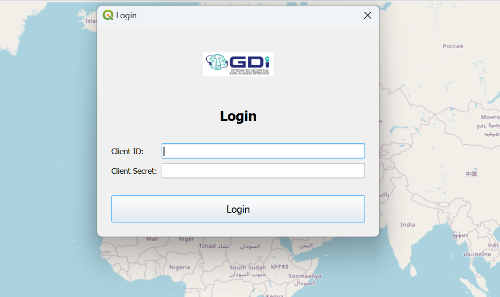
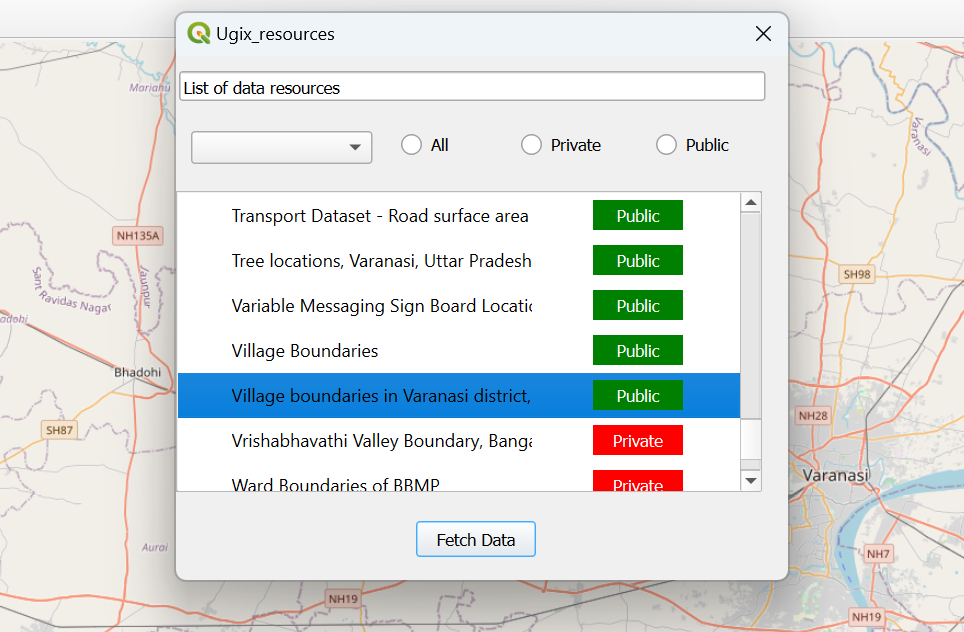
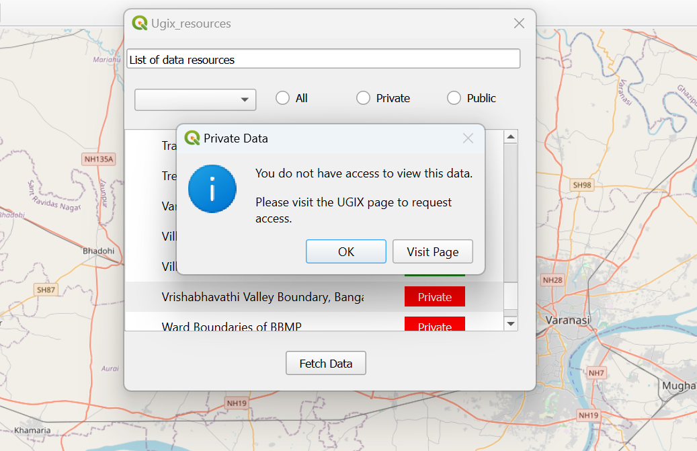
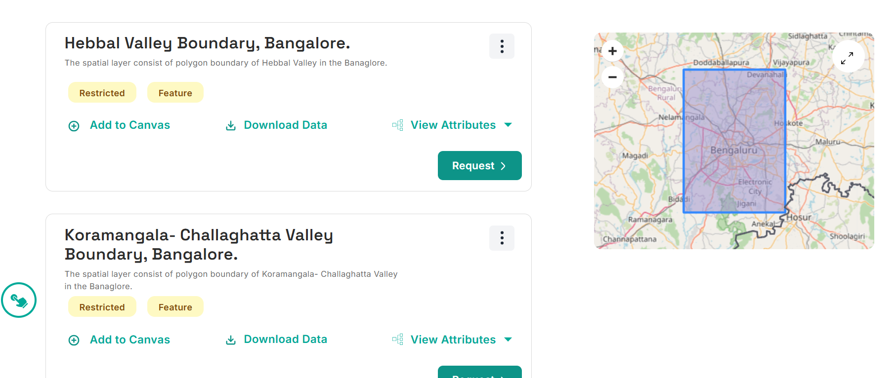

# GDI

The plugin is designed to facilitate seamless discovery and access to data available on the GDI platform by leveraging its integrated APIs: the Data Explorer, Authorization Server, and OGC Resource Server. Through the Data Explorer API, users can efficiently search and locate the datasets relevant to their needs. The Authorization Server API ensures secure and controlled access, verifying user permissions and safeguarding data integrity. Finally, the OGC Resource Server API allows standardized access to geospatial data, enabling direct data retrieval in formats compatible with GIS and other data analysis tools. Together, these components empower users to easily find, access, and utilize the GDI platform's rich data resources for a wide range of applications.

# Registration

## Introduction

All users of the GSX platform must be registered and authenticated to perform any secure operation offered by the platform, which is available at no cost. The details of these secure operations are defined and explained by all GSX components in their respective [API documentation](https://dx.gsx.org.in/apis). The registration process of a user on the GSX platform is a simple three-step process as outlined below: 1. [Creating the Account](#1-account-creation) 2. [Verifying the Email Address](#2-email-verification) 3. [Assigning / Requesting a User Role](#3-requesting-user-roles)

## 1. Account Creation

As the first step when a user accesses the [panel](https://catalogue.gsx.org.in/auth), they need to register as a new user.   Registering is highlighted in the picture.   *Click on Register*

  *Enter Account details*

## 2. Email Verification

The user will receive an email with a verification link at their registered email address. By clicking this link, the user's account will be successfully connected to their email address.

***Note: The verification link will expire in 5 minutes.***

  *Sample email dialog*

Once your email address has been verified, you will be directed to an interface that looks like this:

  *Account created! The final registration step of selecting a role is pending.*

## 3. Requesting User Roles

Once email verification is complete, the user can select their desired roles by clicking on the "Complete Profile" button on the subsequent interface. All roles are associated with a resource server to which the role applies. For example:

-   Choosing the provider role for the resource server "rs.example.com" allows the user to upload resources to the "rs.example.com" resource server and manage access to those resources.
-   Choosing the consumer role for the resource server "rs.example.com" allows the user to request access to resources on "rs.example.com" and access permitted resources on that resource server.

**NOTE: If the user chooses the consumer role, all resource servers are automatically selected, and the user will receive the consumer role for any new resource server that is added.**

  *Choosing consumer role*

### Registration Successful

User will get a popup with the client id and client secrets.

  *Choosing provider role*

## Installing Qgis Plugin

Open the QGIS application, navigate to the "Plugins" section, and click on "Manage and Install Plugins" to search for and install the GDI plugin. Alternatively, you can visit the QGIS website, download the GDI plugin as a ZIP file, and upload it directly into QGIS.

## 1. Login

You would have previously received the client ID and client secret; use those credentials to log in here.

  *Login*

After a successful login, you will receive a list of both public and private data.

## 3. Accessing Public Data

Accessing public data is simple: click on the desired data, then click "Fetch Data," and it will be plotted on the map.

  *Selecting Public Data*

  *Plotting Public Data*

## 3. Accessing Private Data

For private data, click on the desired data in the list and then click "Fetch Data." A popup will appear.

  *Private Data Popup*

Click on "Visit Page," and you will be redirected to a website to request access

  *Request Access*

Once you have requested access, you will be notified upon approval. After receiving access, you can use the data to plot it on the map.